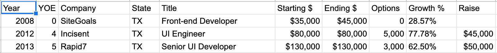

### Or How I Was Vastly Underpaid at the Start of My Career

From 2012 to 2013 I managed to increase my annual salary from $35,000 to $130,000 by changing jobs and negotiating major salary increases. It took months of job hunting after gaining years of experience, but I gained nearly a hundred thousand dollars in just a few conversations. One reason for the large jump in pay is that I was being paid well below my worth prior to 2013. Nonetheless, without negotiating, I could have easily been stuck under six figures for much longer.

Hopefully this post inspires anyone who thinks they are stuck in a low paying job. This post isn't for the Stanford graduate or someone with a ton of connections. I didn’t study _Cracking the Coding Interview_ to land a job at Google or Facebook. None of my salary has ever come in the form of RSUs. So this post isn’t for the kind of person looking for tips on how to get that $500K FAANG payday. This is for the software developer who dropped out or never went to college, living in Omaha, or San Diego, or wherever else outside of Silicon Valley, working for a company that no one has heard of, but wants to finally get paid what they are worth.

### Where I Started

In 2008 I dropped out of college and moved from Sacramento, California to Austin, Texas. I found a summer job at a small design agency. They paid me $35,000 per year to build custom WordPress sites for other small businesses. I was getting paid to do what I did for fun, so I didn’t see the point of finishing my degree.

At the same time as I was learning new programming skills, I was learning about money management from [Ramit Sethi](https://www.iwillteachyoutoberich.com/). I dabbled with doing small freelance projects on the side, which in addition to improving my resume and network, gave me real world experience negotiating compensation. After a few years, I started becoming aware of the demand for software developers and how I could probably be making a lot more money elsewhere. Between 2010 and 2012 I did enough interviews with other companies to boost my confidence enough to start asking for a raise. In 2012 I was given a 28% raise! It felt great at the time, but I quickly learned that I was still being underpaid.

Shortly after that I landed an offer for 77% higher than my recently raised salary. How did that happen? Well at the same time as my raise, I received an offer for a job at $60K. Between that and my recent raise, I had a pretty good idea of what I was worth. When I started talking to the recruiter for my next position, I used [the anchoring effect](https://www.pon.harvard.edu/daily/dealmaking-daily/dealmaking-grappling-with-anchors-in-negotiation/) to set a relatively high bar for salary. I basically asked for double what I was currently making, without telling the recruiter that.

In the actual interview, I leveraged the [the briefcase technique](https://www.iwillteachyoutoberich.com/the-briefcase-technique/) to make a good impression. In the end, they offered just $10K under my initial anchor. I’ve since learned that you should negotiate past the initial offer as well, but I was so happy to be making $35K more per year that I didn’t want to rock the boat. But the lesson in anchoring was cemented in my mind.

I think I felt a bit burned by how long I had stayed at my first job, accepting mediocre raises when I could have jumped ship. I had multiple opportunities to leave, but was convinced by the owner to stay onboard. They couldn’t afford to pay software developer salaries, but they were good people and I had so much fun working there. But the rush of nearly doubling my salary set me up on a chase to repeat the growth as soon as possible. Within a year I was looking for my next job.

With a better resume and lots of interview experience, I started to feel confident about my ability to get an even bigger payday. After many interviews, the company I ended up getting an offer from was on its way to being public. They had an IPO a couple years after I left. So they had money to burn and were willing to pay salaries competitive with the bigger tech companies in Austin, at the time. Instead of anchoring myself, I refused to give them my current salary. I asked the recruiter to give me their expected range for the position. After some back and forth they eventually gave in and gave me their number.

There are certainly times when it can be helpful to anchor the negotiation by naming a number first, but those situations are pretty rare. Most of the time, its better to let them give a number first. Ultimately, this allows you to negotiate up from that number, as opposed to down (or up just a bit) from your number. Can you imagine what my offer would have been had I gave them my current salary? Maybe they would have still offered as much, but it’s likely they would have started at my salary plus ten percent and I would have had to do a lot of work to get that number up.

Instead of just my salary + 10%, in mid 2013, I was given an offer 62% higher than my (already higher) salary. It was 3.8x more than my salary had been just a year and two months prior! I had quadrupled my salary in well under two years.

### Where I’m At Now

Since then, I haven’t achieved anywhere near that level of growth. In reality, I probably spent the first four years of my career being underpaid and it wasn’t until my third job that I finally got up to a healthy baseline. Or maybe I’m deluding myself and I’m still underpaid! Either way, I’m pretty [happy in my current position](/two-year-work-retrospective/), for more than just financial reasons, so I’m not in the same rush I used to be to chase that major salary growth.

Follow me on [Twitter](https://twitter.com/simpixelated) if you want to hear more on salary negotiation, job hunting, interviewing, and career advanced in software development. If you're wondering if you are underpaid, send me a DM! Or let me know if you got an even bigger raise by negotiating.
